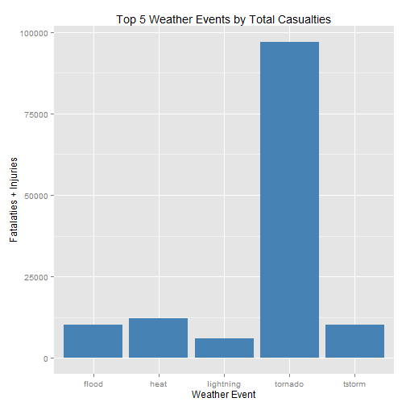
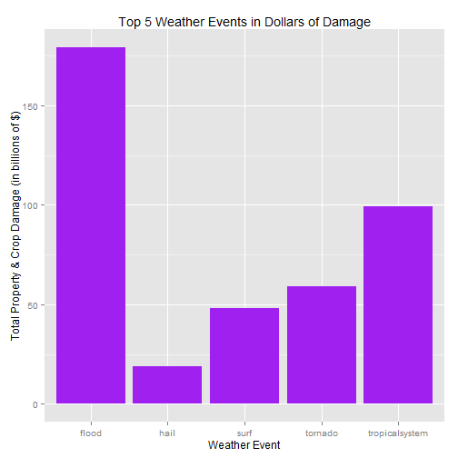

#Summary
In this report we will use data from the US National Oceanic and Atmospheric Administration to determine what types of weather events have the greates impact on human health and the economy. By reclassifying the data into groups based on commonalities in the type of event, we are able to calculate the total number of fatalities and injuries and also the estimated dollar amounts of property damage and crop damage. Using these totals it is shown that tornados cause the greatest number of deaths and injuries by a large margin over the next greates cause, heat. Further it is determined that flooding has caused the greatest economic impact in terms of the estimated cost of the damage to property and crops.

#Data Processing
First download the data from NOAA and load it into an R data frame.

```r
setwd("~/DataScienceCoursera/ReproRes/RepData_PeerAssessment2")
fileURL <- "http://d396qusza40orc.cloudfront.net/repdata%2Fdata%2FStormData.csv.bz2"
download.file(fileURL, destfile="stormdata.csv.bz2")
stormdata <- read.csv(bzfile("stormdata.csv.bz2"))
print(date())
```

```
## [1] "Sun Feb 22 00:24:23 2015"
```

Next we'll make all the column names lowercase for ease of typing. Then, we'll select only the columns in the data frame needed for our analysis.

```r
library(dplyr)
```

```
## 
## Attaching package: 'dplyr'
## 
## The following object is masked from 'package:stats':
## 
##     filter
## 
## The following objects are masked from 'package:base':
## 
##     intersect, setdiff, setequal, union
```

```r
names(stormdata) <- tolower(names(stormdata))
stormdata <- select(stormdata, evtype, fatalities, injuries, propdmg, 
                     propdmgexp, cropdmg, cropdmgexp)
```

To make sure that all damage estimates are in the same unit values we'll convert the propdmgexp and cropdmgexp variables to a number and multiply the values by propdmg and cropdmg variables to obtain new variables totpropdmg and totcropdmg to reflect the monetary damage in a constant dollars.

```r
stormdata$propdmgexp <- gsub("K", 1000, stormdata$propdmgexp)
stormdata$propdmgexp <- gsub("M", 1000000, stormdata$propdmgexp)
stormdata$propdmgexp <- gsub("B", 1000000000, stormdata$propdmgexp)

stormdata$propdmgexp <- as.numeric(stormdata$propdmgexp)
```

```
## Warning: NAs introduced by coercion
```

```r
stormdata$totpropdmg <- stormdata$propdmg * stormdata$propdmgexp

stormdata$cropdmgexp <- gsub("K", 1000, stormdata$cropdmgexp)
stormdata$cropdmgexp <- gsub("M", 1000000, stormdata$cropdmgexp)
stormdata$cropdmgexp <- gsub("B", 1000000000, stormdata$cropdmgexp)

stormdata$cropdmgexp <- as.numeric(stormdata$cropdmgexp)
```

```
## Warning: NAs introduced by coercion
```

```r
stormdata$totcropdmg <- stormdata$cropdmg * stormdata$cropdmgexp
```

Now we'll summarize the data grouped by evtype variable and sum the variables fatalities, injuries, totpropdmg, totcropdmg, as well as create a variable instance to show the number of occurences of each event type.

```r
summary <- stormdata %>%
      group_by(evtype) %>%
      summarise(instance = n(),
                sumfatality = sum(fatalities, na.rm=T),
                suminjur = sum(injuries, na.rm=T),
                sumpropdmg = sum(totpropdmg, na.rm=T),
                sumcropdmg = sum(totcropdmg, na.rm=T))

str(summary)
```

```
## Classes 'tbl_df', 'tbl' and 'data.frame':	985 obs. of  6 variables:
##  $ evtype     : Factor w/ 985 levels "   HIGH SURF ADVISORY",..: 1 2 3 4 5 6 7 8 9 10 ...
##  $ instance   : int  1 1 1 1 4 1 1 1 1 4 ...
##  $ sumfatality: num  0 0 0 0 0 0 0 0 0 0 ...
##  $ suminjur   : num  0 0 0 0 0 0 0 0 0 0 ...
##  $ sumpropdmg : num  200000 0 50000 0 8100000 8000 0 0 5000 0 ...
##  $ sumcropdmg : num  0 0 0 0 0 0 0 0 0 0 ...
##  - attr(*, "drop")= logi TRUE
```

This results in a table with 985 rows. A look at the table reveals that there are many rows with zero for all variables. Also, rows with fewer than 10 injuries or fatalities and fewer than $1000 in damage do not have a significant effect on this analysis therefore we'll remove those.


```r
summary <- filter(summary, sumfatality > 10 & suminjur > 10 |
                   sumpropdmg > 1000 & sumcropdmg > 1000)

summary(summary)
```

```
##               evtype       instance         sumfatality  
##  AVALANCHE       :  1   Min.   :     1.0   Min.   :   0  
##  BLIZZARD        :  1   1st Qu.:     7.0   1st Qu.:   0  
##  COASTAL FLOODING:  1   Median :    73.0   Median :   5  
##  COLD            :  1   Mean   :  7449.9   Mean   : 126  
##  COLD/WIND CHILL :  1   3rd Qu.:   716.2   3rd Qu.:  54  
##  DAMAGING FREEZE :  1   Max.   :288661.0   Max.   :5633  
##  (Other)         :112                                    
##     suminjur         sumpropdmg          sumcropdmg       
##  Min.   :    0.0   Min.   :0.000e+00   Min.   :0.000e+00  
##  1st Qu.:    0.0   1st Qu.:5.000e+05   1st Qu.:4.925e+04  
##  Median :    8.0   Median :8.324e+06   Median :8.868e+05  
##  Mean   : 1179.4   Mean   :3.586e+09   Mean   :4.117e+08  
##  3rd Qu.:  215.8   3rd Qu.:2.989e+08   3rd Qu.:6.365e+07  
##  Max.   :91346.0   Max.   :1.447e+11   Max.   :1.397e+10  
## 
```

This results in a more manageable 118 observations. Another look at the table reveals that there are many closely related event types. We'll collapse these into 20 classifications with a new variable, class. These are the transformations:

* avalanche <- AVALANCHE
* cold <- COLD, COLD/WIND CHILL, DAMAGING FREEZE, EXTREME COLD, EXTREME COLD/WIND CHILL, FREEZE, FROST, FROST/FREEZE
* drought <- DROUGHT
* flood <- FLASH FLOOD, FLASH FLOOD/FLOOD, FLASH FLOODING, FLASH FLOODING/FLOOD, FLOOD, FLOOD, FLASH FLOOD, FLOODING, HEAVY RAINS/FLOODING, RIVER FLOOD, River Flooding, URBAN FLOOD, URBAN FLOODING, URBAN/SML STREAM FLD
* fog <- DENSE FOG, FOG
* hail <- HAIL, SMALL HAIL
* heat <- EXCESSIVE HEAT, EXTREME HEAT, HEAT, HEAT WAVE, UNSEASONABLY WARM
* heavy rain <- HEAVY RAIN, HEAVY RAINS, RAIN
* hurr/trop storm <- HURRICANE, HURRICANE ERIN, HURRICANE FELIX, HURRICANE/TYPHOON, TROPICAL STORM, TROPICAL STORM GORDON, TYPHOON
* ice <- ICE STORM
* landslide <- LANDSLIDE
* lightning <- LIGHTNING
* other <- OTHER
* snow <- BLIZZARD, HEAVY SNOW, WINTER STORM, WINTER STORMS, WINTER WEATHER, WINTER WEATHER/MIX
* surf <- HEAVY SURF/HIGH SURF, HIGH SURF, RIP CURRENT, RIP CURRENTS, STORM SURGE, STORM SURGE/TIDE
* tornado <- TORNADO
* tstorm <- THUNDERSTORM WIND, THUNDERSTORM WINDS, TSTM WIND, TSTM WIND/HAIL
* tsunami <- TSUNAMI
* wildfire <- FOREST FIRES, WILD/FOREST FIRE, WILDFIRE, WILDFIRES
* wind <- DUST STORM, DUST STORM/HIGH WINDS, GUSTY WINDS, HIGH WIND, HIGH WINDS, HIGH WINDS/COLD, MARINE STRONG WIND, STRONG WIND, WIND


```r
class <- c("avalanche", "snow", "surf", "cold", "cold", "cold", "fog", 
           "drought", "wind", "wind", "wind", "heat", "cold", "cold", 
           "heat", "cold", "flood", "flood", "flood", "flood", "flood", 
           "flood", "flood", "flood", "fog", "wildfire", "cold", "cold", 
           "cold", "cold", "wind", "wind", "wind", "hail", "hail", "hail", 
           "heat", "heat", "heat", "heavy rain", "surf", "heavy rain", 
           "flood", "snow", "flood", "surf", "surf", "wind", "wind", 
           "wind", "cold", "tropicalsystem", "tropicalsystem", 
           "tropicalsystem", "tropicalsystem", "tropicalsystem", 
           "tropicalsystem", "flood", "ice", "landslide", "lightning", 
           "wind", "tstorm", "other", "heavy rain", "surf", "surf", "flood", 
           "flood", "flood", "tstorm", "tstorm", "tstorm", "hail", "snow", 
           "surf", "surf", "wind", "wind", "tstorm", "tstorm", "hail", 
           "tstorm", "tstorm", "hail", "tstorm", "flood", "hail", "tstorm", 
           "tstorm", "tstorm", "tornado", "tornado", "tornado", 
           "tropicalsystem", "tropicalsystem", "tropicalsystem", 
           "tropicalsystem", "tstorm", "hail", "tsunami", "tropicalsystem", 
           "heat", "flood", "flood", "flood", "wildfire", "wildfire", 
           "wildfire", "wildfire", "wind", "wind", "wind", "snow", "wind", 
           "snow", "snow", "snow")

summary$class <- class
```

Now we summarize the data by the class variable and sum the variables instance, sumfatality, suminjur, sumpropdmg, sumcropdmg as well as add fatalities and injuries into a new variable, totalcasualty, and add property damage and crop damage into a new variable, totaldamage.

```r
analysis <- summary %>%
      group_by(class) %>%
      summarise(instance = sum(instance),
                sumfatality = sum(sumfatality, na.rm=T),
                suminjur = sum(suminjur, na.rm=T),
                sumpropdmg = sum(sumpropdmg, na.rm=T),
                sumcropdmg = sum(sumcropdmg, na.rm=T)) %>%
      mutate(totalcasualty = sumfatality + suminjur,
             totaldamage = sumpropdmg + sumcropdmg)

analysis
```

```
## Source: local data frame [20 x 8]
## 
##             class instance sumfatality suminjur   sumpropdmg  sumcropdmg
## 1       avalanche      386         224      170      3721800           0
## 2            cold     3953         434      327    208830400  3186134000
## 3         drought     2488           0        4   1046106000 13972566000
## 4           flood    85020        1541     8673 166998118276 12275726200
## 5             fog     1831          80     1076     22829500           0
## 6            hail   289837          20     1467  15773328370  3111215750
## 7            heat     2668        3123     9121     20325750   904473500
## 8      heavy rain    11765          98      255    711833190   794649800
## 9             ice     2006          89     1975   3944927810  5022113500
## 10      landslide      600          38       52    324596000    20017000
## 11      lightning    15754         816     5230    928659366    12092090
## 12          other       48           0        4         5500     1034400
## 13           snow    38580         510     3663   8322800899   289167100
## 14           surf     2280         740      772  48204472500     2411000
## 15        tornado    60672        5658    91346  58525737191   417460310
## 16 tropicalsystem      988         201     1711  92995225560  6201013800
## 17         tstorm   329314         712     9395  10912491768  1206830650
## 18        tsunami       20          33      129    144062000       20000
## 19       wildfire     4228          87     1456   7872463500   403281630
## 20           wind    26656         462     2341   6146388630   758936950
## Variables not shown: totalcasualty (dbl), totaldamage (dbl)
```

This gives us 20 types of weather events in a tidy summary of the number of occurences (instance), number of fatalities (sumfatality), number of injuries (suminjur), total dollar value of property damage (sumpropdmg) and total dollar value of crop damage (totcropdmg) to complete our analysis. The results are below.

#Results
To visualize the weather events that cause the most casualties and injuries we'll graph the top quartile of events that resulted in the most casualties and damage.  
  
First we'll take a look at injuries and fatalities for all weather events between 1950 and 2011.


```r
casualty <- filter(analysis, totalcasualty > 4641)

require(ggplot2)
```

```
## Loading required package: ggplot2
```

```r
health <- ggplot(casualty, aes(class, totalcasualty))
health + geom_bar(stat="identity", fill="steelblue") + 
      labs(title="Top 5 Weather Events by Total Casualties", 
           y="Fatalaties + Injuries", x="Weather Event")
```

 

It's clear that tornados cause the most harm to Americans health. This seems reasonable given the suddeness with which tornados occur combined with our inability to accurately predict when and where a tornado will touchdown.  
  
  
Next we'll take a look the weather events that have caused the most damage in terms of dollars between 1950 and 2011.

```r
damage <- analysis %>%
      filter(totaldamage > 15990000000) %>%
      mutate(damageinbillions = totaldamage / 1000000000)

econ <- ggplot(damage, aes(class, damageinbillions))
econ + geom_bar(stat="identity", fill="purple") +
      labs(title="Top 5 Weather Events in Dollars of Damage", 
           x="Weather Event", 
           y="Total Property & Crop Damage (in billions of $)")
```

 

From this graph it's clear that floods have caused the most property damage, followed by tropical weather systems such as hurricanes and tropical storms. Again this is intuitive considering the wide areas that are effected by both floods and tropical systems.
